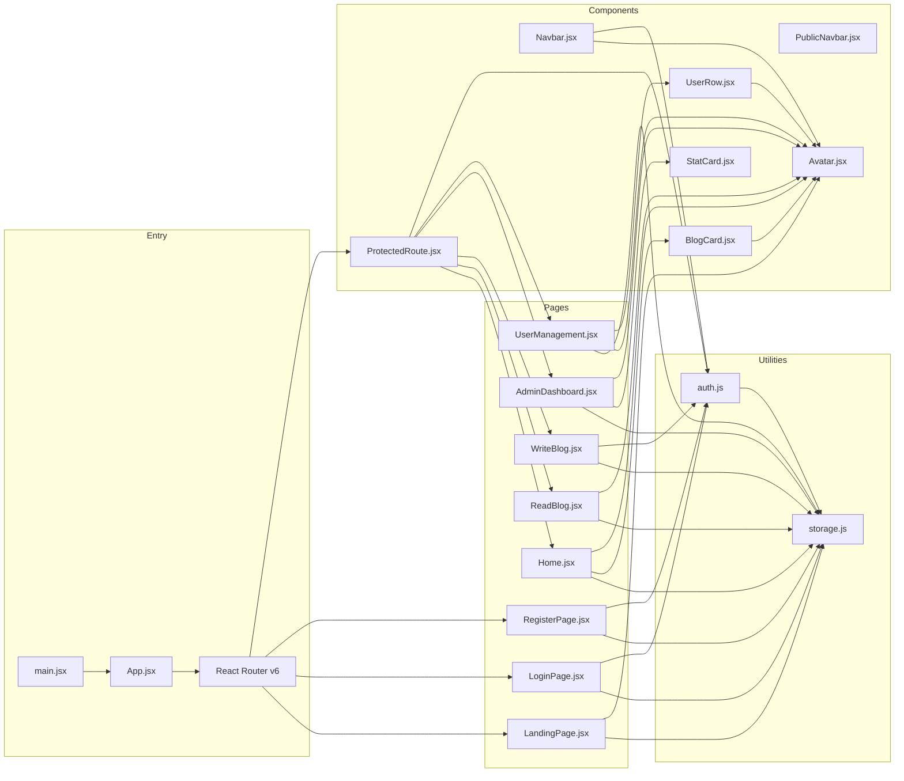

# WriteSpace Architecture

## 1. Overview

WriteSpace is a zero-backend, single-page blog application built with Vite, React 18, and Tailwind CSS, delivering a fully functional MVP that demonstrates role-based authentication (Admin and User), complete blog CRUD with ownership-based access control, and an admin dashboard with user management — all persisted exclusively in the browser's localStorage. The execution model is a client-side SPA with no server-side rendering, no API gateway, no database server, and no authentication service. All routing, state management, data persistence, authentication, and authorization run in the user's browser. The application deploys as a static site on Vercel with SPA rewrites.

## 2. Module / Component Map



### Component Responsibilities

| Module | File Path | Type | Responsibility |
|---|---|---|---|
| `main` | `src/main.jsx` | Entry | ReactDOM.createRoot, renders `<App />` |
| `App` | `src/App.jsx` | Entry | BrowserRouter, route definitions, layout wrapper |
| `LandingPage` | `src/pages/LandingPage.jsx` | Page | Public landing: hero, features, latest posts preview, footer |
| `LoginPage` | `src/pages/LoginPage.jsx` | Page | Login form with hard-coded admin check + localStorage user lookup |
| `RegisterPage` | `src/pages/RegisterPage.jsx` | Page | Self-registration form with validation and unique username check |
| `Home` | `src/pages/Home.jsx` | Page | Blog list: responsive grid of post cards |
| `ReadBlog` | `src/pages/ReadBlog.jsx` | Page | Single post view with ownership-based controls |
| `WriteBlog` | `src/pages/WriteBlog.jsx` | Page | Create/Edit form (reused for both modes) |
| `AdminDashboard` | `src/pages/AdminDashboard.jsx` | Page | Admin stats, quick actions, recent posts |
| `UserManagement` | `src/pages/UserManagement.jsx` | Page | User CRUD table with create/delete |
| `PublicNavbar` | `src/components/PublicNavbar.jsx` | Component | Guest-visible navbar: brand, Login, Register links |
| `Navbar` | `src/components/Navbar.jsx` | Component | Authenticated navbar: role-specific links, avatar chip, logout |
| `ProtectedRoute` | `src/components/ProtectedRoute.jsx` | Component | Route guard: checks session, enforces role requirements |
| `BlogCard` | `src/pages/BlogCard.jsx` | Component | Post preview card with accent border, excerpt, avatar |
| `StatCard` | `src/components/StatCard.jsx` | Component | Admin dashboard stat card with icon, label, count |
| `UserRow` | `src/components/UserRow.jsx` | Component | User table row with avatar, details, delete button |
| `Avatar` | `src/components/Avatar.jsx` | Component | `getAvatar(role)` returning role-distinct JSX |
| `storage` | `src/utils/storage.js` | Utility | All localStorage read/write operations with try/catch |
| `auth` | `src/utils/auth.js` | Utility | Authentication logic, session management |

## 3. Data Flow

### 3.1 Authentication Flow (Login)

1. User navigates to `/login` (or is redirected from a protected route)
2. `LoginPage` renders form with Username and Password fields
3. On submit, `LoginPage` calls `auth.login(username, password)`
4. `auth.login()` first checks hard-coded admin (`username === 'admin' && password === 'admin'`)
5. If not admin, searches `writespace_users` array from `storage.getUsers()`
6. On success: `storage.saveSession({ userId, username, displayName, role })` writes to localStorage
7. `LoginPage` redirects: Admin → `/admin`, user → `/blogs`
8. On failure: inline error "Invalid username or password."

### 3.2 Blog Read Flow

1. User navigates to `/blog/:id`
2. `ProtectedRoute` checks `auth.isAuthenticated()` — redirects to `/login` if not
3. `ReadBlog` reads `useParams()` to get `id`
4. `ReadBlog` calls `storage.getPosts()` to get all posts
5. Finds post by `id` — if not found, renders "Post not found" with back link
6. Reads session via `auth.getCurrentUser()` to determine role and ownership
7. Renders: title, author avatar + display name, createdAt date, full content
8. Conditionally renders Edit/Delete buttons based on ownership and role

### 3.3 Blog Create Flow

1. User navigates to `/write`
2. `ProtectedRoute` checks authentication — redirects to `/login` if not
3. `WriteBlog` renders form with Title and Content fields
4. On submit: validates both fields required, shows inline errors if missing
5. Generates UUID via `crypto.randomUUID()`
6. Sets `createdAt` to `new Date().toISOString()`
7. Sets `authorId` and `authorName` from session
8. Calls `storage.getPosts()`, appends new post, calls `storage.savePosts()`
9. Redirects to `/blog/:id`

### 3.4 Blog Edit Flow

1. User navigates to `/edit/:id`
2. `ProtectedRoute` checks authentication
3. `WriteBlog` reads `useParams()` to detect edit mode
4. Calls `storage.getPosts()`, finds post by `id`
5. Ownership check: if user is not admin and `authorId !== session.userId`, redirects to `/blogs`
6. Pre-fills form with existing title and content
7. On submit: validates, updates post in array, calls `storage.savePosts()`
8. Redirects to `/blog/:id`

### 3.5 Admin Dashboard Flow

1. User navigates to `/admin`
2. `ProtectedRoute` checks authentication AND `role === 'admin'` — non-admins redirected to `/blogs`
3. `AdminDashboard` calls `storage.getPosts()` and `storage.getUsers()`
4. Computes stats: total posts, total users, total admins
5. Renders four stat cards with counts
6. Renders recent posts section (5 most recent) with inline Edit/Delete controls

### 3.6 User Management Flow

1. Admin navigates to `/users`
2. `ProtectedRoute` checks admin role
3. `UserManagement` calls `storage.getUsers()`
4. Renders responsive table (desktop) / stacked cards (mobile)
5. Create User form at top: validates all fields required, username unique
6. On save: generates UUID, adds to users array, calls `storage.saveUsers()`
7. Delete: `window.confirm()` check, removes from array, calls `storage.saveUsers()`
8. Hard-coded `admin` delete button permanently disabled with tooltip
9. Currently logged-in user cannot delete own account

## 4. External Dependencies

| Dependency | Version | Purpose |
|---|---|---|
| `react` | ^18.2.0 | UI framework |
| `react-dom` | ^18.2.0 | DOM rendering |
| `react-router-dom` | ^6.20.0 | Client-side routing |
| `@vitejs/plugin-react` | ^4.2.0 | Vite React plugin |
| `vite` | ^5.0.0 | Build tool |
| `tailwindcss` | ^3.4.0 | Utility-first CSS framework |
| `autoprefixer` | ^10.4.16 | CSS vendor prefixes |
| `postcss` | ^8.4.32 | CSS transformation |

**No other dependencies.** No Redux, no Zustand, no Context API, no `uuid` package, no authentication libraries. `crypto.randomUUID()` for ID generation. React hooks only for state management.

## 5. Persistence Model

All data is stored in browser localStorage under three keys. All reads are wrapped in `try/catch` with fallback values.

### 5.1 Storage Keys

| Key | Type | Description |
|---|---|---|
| `writespace_posts` | `Array<Post>` | All blog posts |
| `writespace_users` | `Array<User>` | All registered users (excluding hard-coded admin) |
| `writespace_session` | `Session \| null` | Current authenticated session |

### 5.2 Data Schemas

**Post Object:**
```
{
  id: string,           // UUID via crypto.randomUUID()
  title: string,        // Post title
  content: string,      // Post content (plain text)
  createdAt: string,    // ISO 8601 timestamp
  authorId: string,     // UUID of author
  authorName: string    // Display name of author
}
```

**User Object:**
```
{
  id: string,           // UUID via crypto.randomUUID()
  displayName: string,  // Display name
  username: string,     // Unique username
  password: string,     // Plain text password (MVP limitation)
  role: 'admin' | 'user',
  createdAt: string     // ISO 8601 timestamp
}
```

**Session Object:**
```
{
  userId: string,       // UUID of authenticated user
  username: string,     // Username
  displayName: string,  // Display name
  role: 'admin' | 'user'
}
```

### 5.3 Storage Utility Functions

| Function | Signature | Description |
|---|---|---|
| `getPosts()` | `() => Array<Post>` | Returns `[]` on error |
| `savePosts(posts)` | `(Array<Post>) => void` | Throws on quota exceeded |
| `getUsers()` | `() => Array<User>` | Returns `[]` on error |
| `saveUsers(users)` | `(Array<User>) => void` | Throws on quota exceeded |
| `getSession()` | `() => Session \| null` | Returns `null` on error or missing |
| `saveSession(session)` | `(Session) => void` | Throws on quota exceeded |
| `clearSession()` | `() => void` | Removes `writespace_session` key |

## 6. Non-Functional Concerns

### 6.1 Authentication & Authorization

Authentication is session-based. On successful login, a session object is written to `writespace_session` in localStorage. The `auth.js` utility provides `login()`, `register()`, `logout()`, `getCurrentUser()`, `isAuthenticated()`, and `isAdmin()` functions. The `<ProtectedRoute>` component wraps authenticated routes and checks the session's `role` field against the route's required role. If the user lacks the required role, they are redirected to their appropriate home (`/blogs` for users, `/admin` for admins, `/login` for guests). **Security note:** Passwords are stored in plain text and route guards are client-side only — this is documented as an MVP limitation. The hard-coded admin account (`username: 'admin', password: 'admin'`) is checked before localStorage user lookup.

### 6.2 Error Handling

All localStorage reads are wrapped in `try/catch` with fallback values (`[]` for arrays, `null` for session). Form validation shows inline field-level error messages. Delete operations use `window.confirm()` before proceeding. Invalid/missing post IDs show "Post not found" with back link. Empty states are handled for all list views (no posts, no users). localStorage quota exceeded errors are not explicitly handled beyond the try/catch — the application assumes typical usage stays within the ~5-10 MB limit.

### 6.3 Performance Budgets

Route transitions must be under 200ms. All operations are synchronous localStorage reads/writes with no network calls. The application uses no animation libraries — the floating card animation on the landing page is CSS-only. Vite's production build produces optimized bundles with code splitting. No lazy loading is implemented given the shallow component tree.

### 6.4 Deployment Target

Deployment target is Vercel as a static site. Configuration requires `vercel.json` with SPA rewrites: `{"rewrites":[{"source":"/(.*)","destination":"/index.html"}]}`. Vercel automatically detects Vite projects and runs `vite build`. Build output is the `dist/` directory. No environment variables are required. Direct URL access to all routes must resolve without 404 errors.

### 6.5 Responsiveness

UI adapts to three breakpoints: stacked layout below 640px (mobile), 2-column grid at `md:` (768px+), 3-column grid at `lg:` (1024px+). Navbar uses hamburger toggle on mobile via React state. All Tailwind classes use responsive prefixes (`sm:`, `md:`, `lg:`). The blog grid uses `grid-cols-1 md:grid-cols-2 lg:grid-cols-3`. User management switches from table (desktop) to stacked cards (mobile).

## 7. Folder Layout (High-Level)

```
writespace/
├── public/                  # Static assets (favicon, etc.)
├── src/
│   ├── components/          # Reusable UI components
│   │   ├── Avatar.jsx       # getAvatar(role) function
│   │   ├── BlogCard.jsx     # Post preview card
│   │   ├── Navbar.jsx       # Authenticated navbar
│   │   ├── ProtectedRoute.jsx  # Route guard wrapper
│   │   ├── PublicNavbar.jsx # Guest-visible navbar
│   │   ├── StatCard.jsx     # Admin stat card
│   │   └── UserRow.jsx      # User table row
│   ├── pages/               # Route-level page components
│   │   ├── AdminDashboard.jsx
│   │   ├── Home.jsx         # Blog list page
│   │   ├── LandingPage.jsx  # Public landing page
│   │   ├── LoginPage.jsx
│   │   ├── ReadBlog.jsx
│   │   ├── RegisterPage.jsx
│   │   ├── UserManagement.jsx
│   │   └── WriteBlog.jsx    # Create/Edit (reused)
│   ├── utils/               # Utility functions
│   │   ├── auth.js          # Authentication logic
│   │   └── storage.js       # localStorage operations
│   ├── App.jsx              # Root component with routes
│   ├── main.jsx             # Entry point
│   └── index.css            # Tailwind directives only
├── index.html               # HTML entry point
├── vercel.json              # SPA rewrite configuration
├── vite.config.js           # Vite configuration
├── tailwind.config.js       # Tailwind configuration
├── postcss.config.js        # PostCSS configuration
└── package.json             # Dependencies and scripts
```